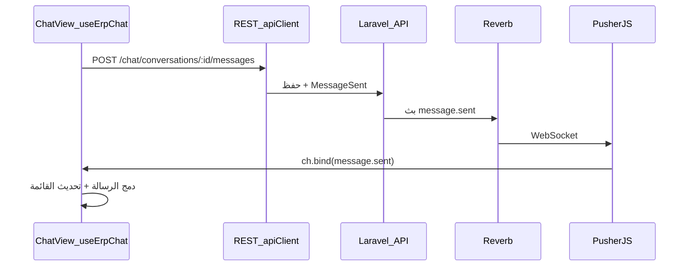

# ربط الدردشة بالوقت الفعلي (CHAT_SYSTEM ↔ Rakez Frontend)

هذا المستند يربط وثيقة عقد الباكند **CHAT_SYSTEM.md** (Laravel + Reverb + `/api/chat/*`) بتطبيق Vue في هذا الريبو. مرجع الوثيقة الأصلية: نسخة المشروع أو `CHAT_SYSTEM.md` من مستودع الـ API.

## ملخص التطابق

| مفهوم (الوثيقة / الباكند) | التنفيذ في الفرونت |
|---------------------------|---------------------|
| REST تحت `/api/chat/*` | [`src/services/chatService.js`](../src/services/chatService.js) عبر `apiClient` (`VITE_APP_API_BASE_URL` + `/chat/...`) |
| بث WebSocket (Reverb، بروتوكول Pusher) | [`src/plugins/pusher.js`](../src/plugins/pusher.js) — `pusher-js` مع `wsHost` / `wsPort` عند تفعيل Reverb |
| مصادقة القنوات الخاصة | `POST /api/broadcasting/auth` + ترويسة `Authorization: Bearer` |
| قناة المحادثة `conversation.{id}` | [`src/composables/chat/useErpChat.js`](../src/composables/chat/useErpChat.js) — اشتراك في `conversation.{id}` و`private-conversation.{id}` |
| حدث `message.sent` | نفس الملف — ربط `message.sent` و`MessageSent` و`message-sent` |
| عدد غير المقروء `GET /api/chat/unread-count` | [`chatService.getUnreadCount()`](../src/services/chatService.js)؛ شارة الهيدر عبر [`useChatUnreadBadge.js`](../src/composables/chat/useChatUnreadBadge.js) |

## تدفق الوقت الفعلي (إرسال رسالة)

## ملفات رئيسية

| الملف | الدور |
|-------|--------|
| [`src/modules/app/views/ChatView.vue`](../src/modules/app/views/ChatView.vue) | واجهة المحادثات |
| [`src/composables/chat/useErpChat.js`](../src/composables/chat/useErpChat.js) | حالة المحادثات، الاشتراك في القنوات، معالجة الأحداث |
| [`src/plugins/pusher.js`](../src/plugins/pusher.js) | إنشاء عميل Pusher متوافق مع Reverb |
| [`src/services/chatService.js`](../src/services/chatService.js) | طبقة REST |
| [`src/composables/chat/useChatUnreadBadge.js`](../src/composables/chat/useChatUnreadBadge.js) | جلب `unread-count` للشارة في الهيدر (مع تحديث دوري) |

## متغيرات البيئة (الفرونت)

انظر [`.env.example`](../.env.example) — قسم **Pusher / Laravel Reverb**. أسماء المتغيرات في الفرونت تبدأ بـ `VITE_APP_PUSHER_*`؛ قيمها يجب أن تطابق مفاتيح تطبيق Reverb في الباكند (`REVERB_APP_KEY` وغيرها). جدول المطابقة مذكور في تعليقات `.env.example`.

## ملاحظات

- مثال `resources/js/chat-example.js` في وثيقة CHAT_SYSTEM يخص مشروع Laravel؛ هذا الريبو يستخدم Vue و`useErpChat` بدلاً منه.
- إن كان الباكند يعرّف القناة كـ **private** فقط، غالباً اسم القناة عند Pusher يكون `private-conversation.{id}`؛ الكود الحالي يجرب أكثر من اسم لتقليل أعطال الربط.
- تحديث شارة الدردشة في الهيدر يعتمد على استدعاء API وتحديث دوري؛ عند فتح `/chat` يُستدعى التحديث فوراً بعد قراءة المحادثات.
